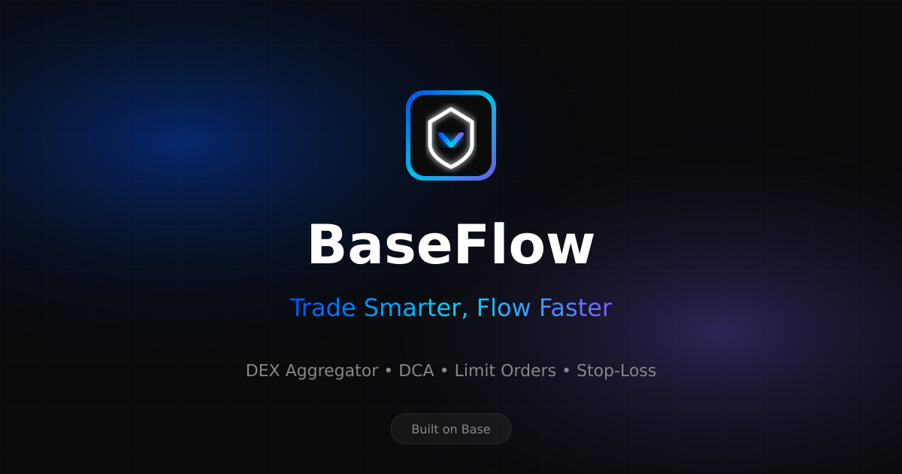

# BaseFlow 🌊

> Trade Smarter, Flow Faster

**BaseFlow** is a DEX aggregator and trading automation protocol built on Base. It aggregates liquidity from multiple DEXs to provide the best rates, and offers automated trading features like DCA, limit orders, and stop-losses.



## ✨ Features

- **🔄 DEX Aggregation** - Find the best swap rates across Uniswap, Aerodrome, BaseSwap, and SushiSwap
- **📈 Dollar-Cost Averaging (DCA)** - Automate recurring purchases to average into any token
- **🎯 Limit Orders** - Set target prices and execute trades automatically when reached
- **🛡️ Stop-Loss Orders** - Protect your positions with automated stop-losses
- **⚡ Low Fees** - Only 0.3% swap fee and 0.5% automation fee
- **🔗 WalletConnect Integration** - Connect with any Web3 wallet via Reown AppKit

## 🛠️ Tech Stack

- **Frontend**: Next.js 14, React 18, Tailwind CSS
- **Web3**: Wagmi, Viem, Reown AppKit (WalletConnect)
- **Smart Contracts**: Solidity 0.8.20, OpenZeppelin
- **Blockchain**: Base (Ethereum L2)
- **UI**: Framer Motion, Lucide Icons, Headless UI

## 📁 Project Structure

```
baseflow/
├── contracts/           # Solidity smart contracts
│   └── BaseFlow.sol     # Main DEX aggregator contract
├── public/
│   └── images/          # App icons, OG images, screenshots
├── scripts/             # Image generation scripts
├── src/
│   ├── app/             # Next.js app router
│   ├── components/      # React components
│   ├── config/          # Web3 and contract configs
│   ├── hooks/           # Custom React hooks
│   └── lib/             # Utility functions
└── package.json
```

## 🚀 Getting Started

### Prerequisites

- Node.js 18+
- npm or yarn
- A WalletConnect Project ID ([Get one here](https://cloud.walletconnect.com/))

### Installation

1. **Clone the repository**
```bash
git clone https://github.com/yourusername/baseflow.git
cd baseflow
```

2. **Install dependencies**
```bash
npm install
```

3. **Set up environment variables**
```bash
cp .env.example .env
```

Edit `.env` and add your:
- `NEXT_PUBLIC_WALLETCONNECT_PROJECT_ID` - Your WalletConnect project ID
- `NEXT_PUBLIC_CONTRACT_ADDRESS` - Deployed BaseFlow contract address

4. **Run the development server**
```bash
npm run dev
```

5. **Open [http://localhost:3000](http://localhost:3000)**

## 📜 Smart Contract Deployment

### Using Remix IDE

1. Open [Remix IDE](https://remix.ethereum.org/)
2. Create a new file `BaseFlow.sol` and paste the contract code from `/contracts/BaseFlow.sol`
3. Compile with Solidity 0.8.20
4. Deploy to Base Mainnet:
   - Select "Injected Provider - MetaMask"
   - Ensure you're connected to Base Mainnet
   - Deploy the contract
5. Copy the deployed contract address to your `.env` file

### After Deployment

After deploying, you need to add DEX routers to the contract:

```javascript
// Add Uniswap V3 Router
await baseFlow.addDex("0x2626664c2603336E57B271c5C0b26F421741e481", "Uniswap V3");

// Add Aerodrome Router
await baseFlow.addDex("0xcF77a3Ba9A5CA399B7c97c74d54e5b1Beb874E43", "Aerodrome");

// Add BaseSwap Router
await baseFlow.addDex("0x327Df1E6de05895d2ab08513aaDD9313Fe505d86", "BaseSwap");

// Add SushiSwap Router  
await baseFlow.addDex("0x6BDED42c6DA8FBf0d2bA55B2fa120C5e0c8D7891", "SushiSwap");
```

## 🎨 Farcaster Mini App

BaseFlow is built to be a Farcaster Mini App. The following assets are included:

| Asset | Size | Purpose |
|-------|------|---------|
| `icon.png` | 512x512 | App icon |
| `og-image.png` | 1200x630 | Social sharing |
| `splash.png` | 1200x1200 | Farcaster splash screen |
| `screenshot.png` | 1170x2532 | App store screenshot |
| `favicon.ico` | 32x32 | Browser favicon |

### Farcaster Manifest

The `farcaster-manifest.json` is included in `/public/`. Update it with your account association after deployment.

## 📱 Building for Production

```bash
npm run build
npm run start
```

## 🔧 Available Scripts

| Script | Description |
|--------|-------------|
| `npm run dev` | Start development server |
| `npm run build` | Build for production |
| `npm run start` | Start production server |
| `npm run lint` | Run ESLint |
| `npm run generate-images` | Regenerate all images |

## 🤝 Contributing

Contributions are welcome! Please feel free to submit a Pull Request.

## 📄 License

MIT License - see [LICENSE](LICENSE) for details.

## 🔗 Links

- **Website**: [baseflow.app](https://baseflow.app)
- **Twitter**: [@baseflow](https://twitter.com/baseflow)
- **Farcaster**: [@baseflow](https://warpcast.com/baseflow)
- **Base Network**: [base.org](https://base.org)

---

Built with 💙 on Base
